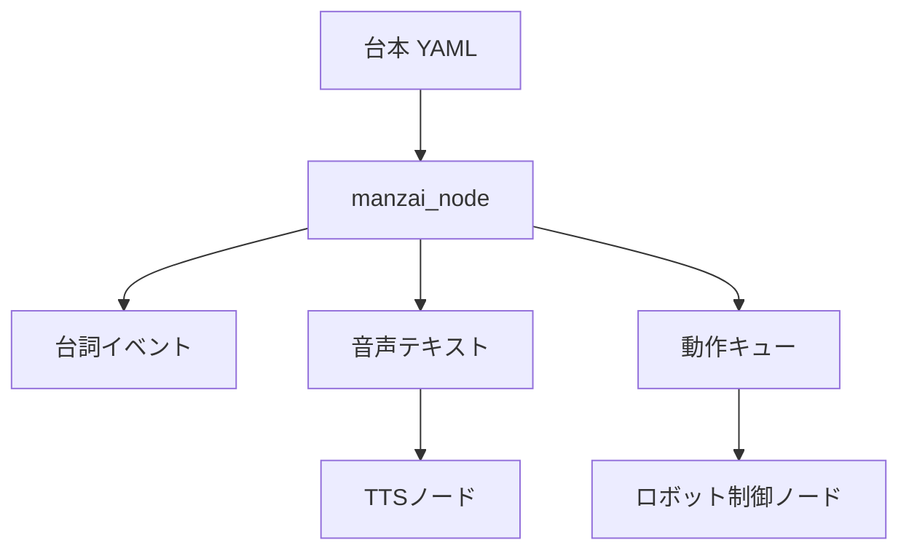

# ロボット漫才プロジェクト設計

## 目的

2台のロボットが「ボケ」と「ツッコミ」を分担し、台詞・音声・身振りを同期して漫才を実演できるROS 2システムを段階的に構築する。

最初の実装ではハードウェアに依存しない進行ノードを用意し、後から音声合成、ロボット制御、観客反応へ差し替えられる構成にする。

## アーキテクチャ



`manzai_node` は台本の進行だけを担当する。TTSや実機APIを直接呼ばないため、シミュレーターと実機の両方で再利用できる。

## インターフェース

| 名前 | 型 | 内容 |
|---|---|---|
| `/manzai/line` | `std_msgs/msg/String` | JSON形式の統合イベント |
| `/manzai/speech_text` | `std_msgs/msg/String` | 現在の台詞本文 |
| `/manzai/motion_cue` | `std_msgs/msg/String` | `nod`、`point`などの動作名 |

統合イベントの例:

```json
{
  "index": 0,
  "total": 4,
  "role": "boke",
  "text": "最近、人工知能で空気が読めるようになりまして。",
  "emotion": "proud",
  "motion": "nod"
}
```

## 台本データ

台本は `config/*.yaml` に保存する。各行には次の項目を指定する。

- `role`: `boke` または `tsukkomi`
- `text`: 発話本文
- `emotion`: 音声・表情制御用の感情名
- `motion`: 実機・シミュレーターで実行する動作名
- `pause_sec`: 次の台詞までの待ち時間

## ロードマップ

### Phase 1: 台本再生

- ROS 2パッケージ化
- YAML台本の読み込みと検証
- 台詞・音声・動作トピックの配信
- サンプル台本とlaunchファイル

### Phase 2: 音声と身振り

- 日本語TTSノードを追加
- ボケ役・ツッコミ役へのルーティング
- Gazebo上の身振りアニメーション
- 発話完了イベントによる正確な同期

### Phase 3: 実機連携

- 対象ロボットのSDK／コントローラー接続
- 非常停止と動作範囲制限
- マイク・カメラ入力
- 観客の笑い・拍手に応じた間の調整

### Phase 4: 生成AI

- テーマから台本候補を生成
- 禁止表現・長さ・役割交代の検証
- 人間による承認後のみ上演
- 上演ログから台本を改善

## 安全方針

- 生成台本を無承認で実機上演しない
- 動作キューを実機固有の安全なプリセットへ変換する
- 非常停止、速度上限、関節角度上限を実機制御ノード側で保証する
- 音声・映像を保存する場合は、収録と利用目的を明示する
